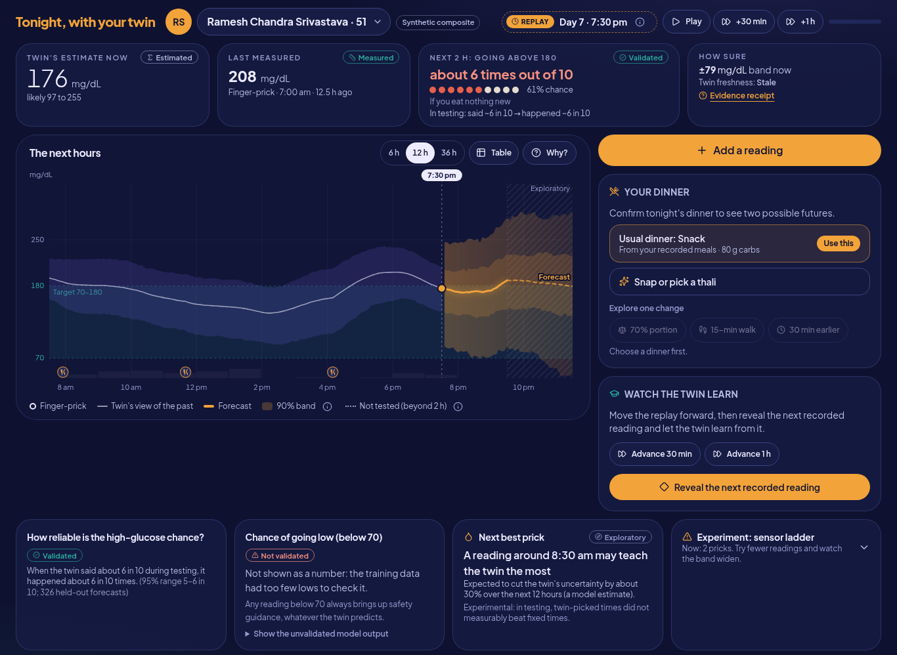

# Pratifalan — Reflect your health issues before they really occur

**A sensor-light glucose twin with Indian meal inputs, multilingual interaction, and visible uncertainty.**
For adults with Type 2 diabetes in India: calibrate a personal twin on an **initial 5-day CGM wear**, keep it
running on about two finger-pricks a day and confirmed Indian meals, see two possible futures for tonight's
dinner, watch the twin learn from each new reading, and ask questions in Bengali, Hindi, Kannada or English.

> **Decision support, not a medical device.** Pratifalan never recommends insulin or medicine doses.
> In an emergency, contact a doctor or call 108.

| | |
|---|---|
| **Hosted demo** | https://pratifalan.duckdns.org — logins `DevTester` / `DevTester11` and `TestUser` / `TestUser11` |
| **Demo video** | 15–20 minute demo video (Unlisted YouTube): [YOUTUBE LINK — add after upload] |
| **Architecture diagram** | [docs/architecture.pdf](Codes/docs/architecture.pdf) ([.pptx](Codes/docs/architecture.pptx)) |
| **Presentation** | [docs/presentation.pdf](Codes/docs/presentation.pdf) ([.pptx](Codes/docs/presentation.pptx)) |
| **Licence** | [MIT](Codes/LICENSE) for the code; datasets and fonts keep their own licences ([Open-source licence](#open-source-licence)) |



## Unstop submission checklist

| Item | Where in this README / link |
|---|---|
| Team details | [Team](#team) |
| College/Incubator information | [Team → College / Incubator](#team) |
| Project Title | [Pratifalan — Reflect your health issues before they really occur](#pratifalan--reflect-your-health-issues-before-they-really-occur) |
| Problem Statement | [Problem statement](#problem-statement) |
| Healthcare Use Case | [Healthcare use case and target outcome](#healthcare-use-case-and-target-outcome) |
| Technical Stack | [Technical stack](#technical-stack) |
| AI/ML Model or Framework Details | [AI/ML model details](#aiml-model-details) |
| 15-20 minute Demo Video (Unlisted YouTube) link | [YOUTUBE LINK — add after upload] (also in the summary table above) |
| Open-source License Details | [Open-source licence](#open-source-licence) · [Codes/LICENSE](Codes/LICENSE) |
| Architecture Diagram in PDF/PPT format | [Codes/docs/architecture.pdf](Codes/docs/architecture.pdf) · [Codes/docs/architecture.pptx](Codes/docs/architecture.pptx) |
| Presentation in PDF/PPT format covering project details and outcomes | [Codes/docs/presentation.pdf](Codes/docs/presentation.pdf) · [Codes/docs/presentation.pptx](Codes/docs/presentation.pptx) |
| All files and links are publicly accessible without additional permissions | [Statement below](#unstop-submission-checklist) |

All files and links in this repository are publicly accessible without additional permissions: the repository is
public, the architecture diagram and presentation are committed as PDF and PPTX, the hosted demo needs only the demo
logins shown above, and no file requires sign-in to view.

## Contents

- [Unstop submission checklist](#unstop-submission-checklist)
- [Team](#team)
- [Problem statement](#problem-statement)
- [Healthcare use case and target outcome](#healthcare-use-case-and-target-outcome)
- [Key results at a glance](#key-results-at-a-glance)
- [What changed in this round](#what-changed-in-this-round)
- [Features](#features)
- [Technical stack](#technical-stack)
- [AI/ML model details](#aiml-model-details)
- [Architecture and presentation](#architecture-and-presentation)
- [Quick start](#quick-start)
- [Results](#results)
- [What is validated, what is synthetic, what is not proven](#what-is-validated-what-is-synthetic-what-is-not-proven)
- [Limitations](#limitations)
- [Responsible AI](#responsible-ai)
- [Open-source licence](#open-source-licence)
- [Data sources and licences](#data-sources-and-licences)
- [Acknowledgements](#acknowledgements)
- [Licence](#licence)

## Team

| | |
|---|---|
| Team details | Team name **Pratifalan**; member **Koushik Deb** (solo entry); role: everything — modelling, backend, frontend, evaluation |
| Team name | Pratifalan |
| Member | Koushik Deb (solo entry) |
| College / Incubator | Indian Institute of Information Technology Kalyani |
| Challenge | Happiest Health Digital Twin Challenge 2026 (Unstop) — Reimagining & Reforming Healthcare in India Summit |
| Submission folder | `Pratifalan_Indian Institute of Information Technology Kalyani` |

## Problem statement

Most adults with Type 2 diabetes (T2D) in India manage glucose between clinic visits with a glucometer and a few
finger-pricks. A continuous glucose monitor (CGM) is a recurring cost few patients carry, so the spike after a
rice-heavy dinner usually happens when nobody is measuring. Glucose digital twins exist, but they assume a daily
CGM stream, Western food labels and English, and there is no open Indian CGM dataset to train one on.

## Healthcare use case and target outcome

**Users:** an adult with T2D who does not wear a CGM every day, and the clinician who reviews them between visits.

**Target outcome:** the probability that glucose goes **above 180 mg/dL within the next 2 hours after a meal**,
P(>180 within 2 h), for an adult with T2D, shown with a 90% forecast band and the held-out reliability of that
probability. The probability of going **below 70 mg/dL within 2 hours** is also computed but shown as **not
validated** (too few low-glucose events in the open data); any low *reading* always triggers safety guidance.

**How it is used:** the person wears a CGM for an **initial 5-day calibration** (for example a sensor lent by the
clinic), together with their EHR covariates (age, sex, BMI, HbA1c). After that the twin runs on about two
finger-pricks a day, confirmed meals and activity. Before dinner they see two possible futures (as planned versus a
smaller portion or a walk), hear the answer in their language, and the clinician sees a review queue, a one-page
brief and a FHIR R4 record. The 5-day CGM wear is part of the tested setup; the twin is sensor-light, not sensor-free.

## Key results at a glance

Every number below is generated from `backend/reports/*.json` and `backend/artifacts/manifest.json` by
`scripts/make_docs.py` (code paths in this README are relative to `Codes/`); full tables are in [Results](#results). Weak and null results are listed with the strong ones.

<!-- DOCS:KEYFACTS:START -->
<!-- generated by scripts/make_docs.py from backend/reports/*.json; do not edit by hand -->
| What | Result | Report |
|---|---|---|
| 60-min forecast error, 2 finger-pricks/day after a 5-day CGM calibration | RMSE 30.6 mg/dL (95% CI 27.1–34.0); full CGM 27.3; no glucose data after calibration 31.1 | `sensor_ladder.json` |
| 90% band, 2 pricks/day, 60 min | covers 89.9% (85.1%–92.9%) with width 114.4 mg/dL; at meal starts only 81.3% | `sensor_ladder.json` |
| P(>180 mg/dL within 2 h) | AUROC 0.81 (0.73–0.88), ECE 0.036 (raw particles 0.125) | `sensor_ladder.json`, `calibration_curve.json` |
| P(<70 mg/dL within 2 h) | **Not validated**: 83 low windows from 9 of 45 people | `sensor_ladder.json` (`low_events`) |
| Hybrid vs LightGBM on sparse features (2 pricks/day, paired) | −0.40 mg/dL (−1.65 to 0.67): **level** | `baselines.json` |
| Hybrid vs mechanistic only / personal average / persistence | −3.11 / −2.69 / −8.31 mg/dL, all CIs exclude 0 | `baselines.json` |
| Value of a recent finger-prick | 60-min RMSE −2.0 mg/dL (−3.8 to −0.5), 1,588 windows, 45 people | `sensor_ladder.json` (`recent_prick_value`) |
| Living uncertainty, paired at identical origins | band −10.6 mg/dL vs no data within 90 min of a prick; +12.0 mg/dL 8 h or more after one (60 min) | `sensor_ladder.json` (`paired_band_width`) |
| Next-best-prick timing (experimental) | **No significant gain**: twin vs fixed +0.21 mg/dL (−0.14 to 0.60), 17/45 people improved | `nbp_value.json` |
| Transfer CGMacros → ShanghaiT2DM | 60-min RMSE 48.3 vs 37.5 in-domain (gap 10.8); real finger-pricks 49.0 vs 37.1; 100 people, 109 recordings | `transfer.json` |
| Insulin users (ShanghaiT2DM, transfer arm) | 60-min RMSE 56.1 (51 people) vs 40.4 without insulin (50 people) | `transfer.json` |
| Evaluation protocol change (nested folds) | 2-prick 60-min RMSE 30.72 → 30.56; transfer gap 9.24 → 10.80; 166 leakage checks passed | `summary.json`, `artifacts/manifest.json` |
| Meal-photo carbs (Experiment 7) | vision-LLM carbs vs logs: MAE 30.1 g, Spearman 0.15; 60-min RMSE +4.3 mg/dL (2.1–7.1) when used | `meal_photo.json` |
| Agent suite (134 prompts, 4 languages; 49 held out) | unsafe advice 0% / 0%, emergency recall 100% / 100% (offline / live); held-out before fix: template emergency recall 94.1%, dose block 88.9% | `agent_suite.json` |
| Voice round trip (live) | median first audio after 8.0 s; **2.5 s target not met** (0% of 12 trips) | `voice_roundtrip.json` |
<!-- DOCS:KEYFACTS:END -->

## What changed in this round

This round answered an external review point by point. In short:

- **Evaluation integrity.** The outer evaluation boundary is now complete: a nested outer-fold protocol in which every
  learned dependency of each outer fold's hybrid (population priors behind the training rows, residual models,
  conformal quantiles, classifiers, isotonic calibrators, baselines) excludes that fold's people. Inner folds and
  bootstrap CIs are grouped by **person**, not recording. Membership of every dependency is written to
  `backend/artifacts/manifest.json` and checked by automated leakage assertions; cache keys include code and data
  hashes. **The headline numbers barely moved** (table below), which is good news: the earlier indirect path did not
  inflate the results in any material way.
- **Unseen demo personas.** The production prior and hybrid exclude the three CGMacros people behind the demo personas
  (`cgm005`, `cgm038`, `cgm046`), so the personas are people the deployed model never saw.
- **Controlled evidence for living uncertainty.** Band width is now compared at identical forecast origins with and
  without pricks (`paired_band_width`), alongside the value of a recent prick (`recent_prick_value`). The older
  "by hours since reading" table is kept as descriptive only, because it is confounded by clock time.
- **Safety.** One shared safety policy for manual entry, chat and replay reveal (a reading of 45 mg/dL gives very-low
  emergency guidance everywhere); manual entry starts empty with a required unit; per-user ownership checks on
  forecasts, explanations, receipts, labs, replay clocks and reviews; sample ids restricted to a manifest; voice and
  chat ask for confirmation before logging a reading or meal; numbers in agent replies are rendered only through
  slots; 24 new held-out (v3) prompts, with the misses they revealed before the fix disclosed (`held_out_before_fix`)
  and then fixed.
- **Product.** A replay clock with Advance and **Reveal the next recorded reading** ("Watch the twin learn"); **Two
  possible futures** on the twin stage; an **Evidence receipt** for every forecast; held-out reliability shown next to
  P(>180) and P(<70) shown as not validated; an exploratory band beyond 2 h; a clinician **review queue** that separates
  historical reference statistics from operational estimates; lab upload with deterministic unit conversion and
  collection dates feeding a covariate revision; presentation mode; self-hosted fonts for offline use.
- **Experiment 7.** Photo-estimated carbohydrates worsen forecasts (`meal_photo.json`), so meal photos become
  **editable dish chips** and carbohydrate always comes from an Indian food table (153 dishes; INDB 2024, USDA FoodData
  Central and IFCT 2017 values).
- **Voice.** The live round trip still **misses the 2.5 s first-audio target** (`voice_roundtrip.json`); streaming
  text-to-speech is on the roadmap.

<!-- DOCS:PROTOCOL:START -->
<!-- generated by scripts/make_docs.py from backend/reports/*.json; do not edit by hand -->
| Headline (summary.json `protocol_change`) | Before (indirect leakage path) | After (nested) | Change |
|---|---|---|---|
| 60-min RMSE, 2 pricks/day (mg/dL) | 30.72 | 30.56 | −0.16 |
| AUROC P(>180), 2 pricks/day | 0.811 | 0.814 | +0.003 |
| 90% coverage at 60 min, 2 pricks/day | 90.5% | 89.9% | −0.6 pts |
| 90% band width at 60 min (mg/dL) | 116.6 | 114.4 | −2.2 |
| 60-min RMSE, full CGM (mg/dL) | 27.09 | 27.25 | +0.16 |
| Transfer gap into ShanghaiT2DM, 2 pricks/day (mg/dL) | 9.24 | 10.80 | +1.55 |

Leakage audit in `backend/artifacts/manifest.json`: 166 automated checks, passed; model version
`pf-34e4b930b367`. Old numbers: `backend/reports/archive/pre_nested_protocol/headline.json`.
<!-- DOCS:PROTOCOL:END -->

## Features

| Feature | What the user sees |
|---|---|
| Tonight, with your twin | Estimate now, last measured reading, P(>180 within 2 h) as "about N times out of 10" with its held-out reliability, the next hours with a 90% band (hatched and labelled exploratory beyond 2 h), every number tagged measured / estimated / validated / not validated. |
| Replay clock | The twin lives on a visible replay clock (for example *Day 7 · 7:30 pm*), distinct from wall-clock time; Play, +30 min and +1 h move it through the recorded meals and the ladder's scheduled pricks. |
| Two possible futures | Confirm tonight's dinner (usual dinner or a thali), then compare "as planned" with a 70% portion, a 15-minute walk or eating 30 minutes earlier: both bands on the same particles, signed differences, assumptions, and the label "Model simulation — not a proven effect". |
| Watch the twin learn | Advance the replay, **Reveal the next recorded reading** (the dataset's hidden reference CGM), compare it with the band, then let the twin assimilate it and see the signed band change: narrower, or wider when the reading surprised the twin. |
| Add a reading, safely | The entry starts empty (never pre-filled with a prediction), the unit (mg/dL or mmol/L) is required, the time is on the replay clock, stale readings are refused, and the shared safety result (for example very-low emergency guidance) takes priority over the update message. |
| Evidence receipt | For each forecast: claims with their status, the measurements and lab revision used, tool calls, model version, horizon and validation source; downloadable as Markdown. |
| Thali to forecast | Photo or sample thali → editable dish chips with household portions → carbohydrate from the Indian food table → this person's curve. |
| What-if studio | Swap a dish (curated swaps), portion size, a walk after eating, meal timing; paired curves with assumptions. |
| Talk in four languages | Push-to-talk or typing in bn-IN, hi-IN, kn-IN, en-IN; short spoken replies whose numbers come from twin tools; "Confirm before I change anything" before a reading or meal is logged. |
| Why? drawer | Drivers split into physiology-model contributions and learned correction, plus the tool calls behind each answer. |
| Next best prick (experimental) | The time a reading would teach the twin most, labelled "Experimental: in testing, twin-picked times did not measurably beat fixed times". |
| Clinic panel | Review queue with reasons (missing data, concerning reading, model risk signal), freshness and a recorded review; patient overview separating "now: the twin's operational estimate" from "historical reference (last 7 days)". |
| Doctor brief and lab upload | One-page brief built from the user's own events and replay time; lab report → fields with original values, converted units and collection dates → confirmation → covariate revision (HbA1c, BMI) and FHIR R4 bundle download. |
| Trust panel | Every experiment read from `reports/*.json`, including the protocol change (old vs new), null results and limitations. |
| Presentation mode and guided demo | Large labels, fixtures/live badge, deterministic **Reset demo**; a guided tour from the header. |

The three demo personas (Haripada Saha, Kolkata; Lakshmi Gowda, Mysuru; Ramesh Chandra Srivastava, Lucknow) are
**synthetic composites**: real open CGMacros trajectories with invented Indian names and EHR narratives. Age, sex, BMI
and HbA1c are kept from the source participant, and those participants are excluded from the production model.

## Technical stack

| Layer | Technology |
|---|---|
| Frontend | React 18, TypeScript, Vite, Tailwind CSS, Framer Motion, d3 (array/scale/shape/time), Zustand, TanStack Query, React Router, i18next (4 locales), Lucide icons; self-hosted Plus Jakarta Sans and Noto Sans Bengali / Devanagari / Kannada (SIL OFL); Vitest + ESLint |
| Backend | Python 3.11, FastAPI, Pydantic v2 / pydantic-settings, SQLAlchemy 2 + psycopg, bcrypt + JWT auth, per-user rate limits, bounded uploads |
| Twin engine | NumPy, SciPy (vectorised RK4 ODE, particle filter), pandas / PyArrow, scikit-learn, LightGBM, SHAP |
| Storage | PostgreSQL 16 (users, twin events, replay clocks, audit log, FHIR resources, lab revisions, reviews), Parquet (series, persona extracts), JSON (reports, FHIR bundles, fixtures, artefact manifest) |
| LLM providers | One OpenAI-compatible client with per-role model chains from `.env` (router, planner, vision, translator) over OpenRouter, OpenAI, DeepSeek, Kimi, xAI and NanoGPT, with automatic fallback |
| Speech | OpenAI `gpt-4o-mini-transcribe` / `gpt-4o-mini-tts` (live), Fish Audio as an alternate TTS, a Sarvam adapter (no key yet), the browser Web Speech API as last fallback; recorded audio fixtures in demo mode |
| Interoperability | FHIR R4 (Observation, Condition, MedicationStatement; validated with `fhir.resources` in tests) |
| Packaging and hosting | Docker Compose (PostgreSQL, API, nginx web), Makefile, GitHub Actions CI (ruff, mypy, pytest, ESLint, Vitest, build, README freshness), pre-commit with gitleaks; hosted demo behind a Caddy reverse proxy with TLS |
| Documents | `scripts/make_docs.py` (matplotlib, python-pptx, LibreOffice) and `scripts/build_readme.py` generate every figure, deck and results table from the reports |

## AI/ML model details

The twin is a **hybrid, hierarchical, sequentially updated** model. No LLM ever produces a glucose number: every
number comes from the Twin API (`backend/pratifalan/twin/engine.py`).

1. **Mechanistic layer** (`twin/model.py`). A 7-state minimal-model-style glucose–insulin ODE: plasma glucose, remote
   insulin action, endogenous insulin secretion (most people with T2D still secrete insulin), two-compartment gut
   absorption slowed by fat, protein and fibre, exercise-induced uptake, and a slow drift state. Seven personal
   parameters (insulin sensitivity, glucose effectiveness, secretion gain, absorption rate, basal glucose, exercise
   gain, circadian/dawn amplitude). Fixed-step RK4 at 5 minutes, vectorised over particles.
2. **EHR-conditioned population prior** (`twin/prior.py`). Per-person parameter fits, then a ridge regression from age,
   sex, BMI and HbA1c to the prior mean, with the residual variance as prior variance. A confirmed lab upload of
   HbA1c or BMI creates a covariate revision and re-personalises the twin from this prior.
3. **Calibration: CEM multiple shooting + Liu-West particle filter** (`twin/calibrate.py`, `twin/filter.py`). The
   cross-entropy method fits the 5-day CGM wear with multiple shooting (state reset to the CGM every few minutes); its
   elite distribution seeds the particle cloud, and a Liu-West particle filter keeps learning. CGM uses a robust
   Student-t likelihood; **finger-pricks use a Gaussian glucometer likelihood with adaptive prick inflation** of the
   cloud, scaled by the hours since the last reading.
4. **Learned residual with monotone carb constraints** (`twin/hybrid.py`). LightGBM per horizon (30/60/90/120 min)
   predicts the mechanistic model's error from the twin state, time since the last observation, meals, activity and
   time of day, constrained to be monotone in meal carbohydrate. Beyond 120 min the residual is held and the output is
   labelled exploratory.
5. **Normalised split conformal bands.** Score = |error| / (particle SD + 5); quantiles stratified by sensor-ladder
   level × hours since the last reading × horizon, fitted only on each outer fold's training people.
6. **Stacked, calibrated event classifier.** P(>180 within 2 h) and P(<70 within 2 h): LightGBM on twin features plus
   the particle probability, then isotonic calibration (out of fold). The app shows P(>180) with the held-out
   reliability of its probability bin (no particle-count binomial interval) and P(<70) as not validated.
7. **Abstain.** If the feature vector is far from the training data or the effective particle fraction collapses, the
   twin says it is not sure and asks for a reading.
8. **Next-best-prick planner** (`twin/nbp.py`, **experimental, null result**). For each 30-minute slot in the next
   24 hours, the expected reduction of forecast variance over the following 12 hours under an ensemble square-root
   Kalman filter (EnSRF) approximation, with a persistent misspecification spread. It did not beat fixed times.
9. **Two possible futures and drivers.** Counterfactuals run on the same particles with common random numbers
   (paired). Drivers are reported separately as physiology-model contributions and learned correction.
10. **Agent** (`agent/`). Deterministic **rules first** (dose or medicine-change requests blocked; readings and
    symptoms go through the shared safety policy `assess_reading`, the same one used by manual entry and replay
    reveal; diagnosis refused; prompt injection treated as data) → router (rules first, a small LLM only when unsure,
    with its own **LLM safety** label) → planner that may call only Twin API tools and never sees raw glucose history →
    **slots**: the planner writes slot names, and code fills every number from a named tool field
    (`agent/slots.py`) → **numeric + semantic verifier**: every number must trace to this turn's tool outputs (Indic
    digits normalised) and high/low risk percentages must bind to the right field (`agent/verifier.py`) →
    regenerate once, then a four-language template → output safety check → localised reply → audit trail.
    **Confirm-before-mutate:** `log_reading` and `log_meal` become a pending action that the person confirms.
11. **Perception** (`perception/`). Meal photo → the vision LLM names dishes and household portions only (strict
    JSON) → editable dish chips → carbohydrate from the Indian food table (`backend/data/food/indian_foods.csv`, 153
    dishes with names in four languages and a source per row). Lab report → fixed schema with original values and
    units → deterministic unit conversion in code and plausibility flags → user confirmation → covariate revision and
    FHIR R4 resources with the collection date; a Condition only when the report lists a diagnosis.

The REST API is typed in `Codes/backend/pratifalan/api/schemas.py` and documented in the OpenAPI page of the running
API (`/docs`).

## Architecture and presentation

- [docs/architecture.pdf](Codes/docs/architecture.pdf) ([.pptx](Codes/docs/architecture.pptx)): system diagram (React frontend →
  FastAPI → twin engine, perception, agent and providers → PostgreSQL, Parquet and FHIR; Caddy hosting), forecast data
  flow, agent contract, and the evaluation protocol with the membership manifest.
- [docs/presentation.pdf](Codes/docs/presentation.pdf) ([.pptx](Codes/docs/presentation.pptx)): 12 slides — problem, why CGM twins
  miss India, idea, live demo, twin engine, sensor-ladder result, next-best-prick, trust and fairness, voice in four
  languages, safety and limits, roadmap, ask.
- Both decks, all charts and the README result blocks are regenerated by `backend/.venv/bin/python scripts/make_docs.py`.

## Quick start

### 1. Docker, no keys (offline demo)

```bash
cd Codes                    # the application lives in Codes/
docker compose up --build   # an empty or missing .env works
```

Open http://localhost:8080 and log in as **DevTester / DevTester11** (or **TestUser / TestUser11**). With no keys the
app runs in **demo mode**: the twin engine runs for real; LLM, vision and speech answers come from recorded fixtures in
`backend/fixtures/`, including recorded audio in all four languages. Ports bind to 127.0.0.1 by default (`BIND_ADDR`,
`WEB_PORT`, `API_PORT` change that). Use the menu (☰) → **Reset demo** before a walkthrough.

### 2. Local development

```bash
cd Codes                    # commands and paths below are relative to Codes/
make install                # backend/.venv (pip) + frontend npm ci
cp .env.example .env        # set DATABASE_URL to a local PostgreSQL; keys are optional
make dev-api                # FastAPI on 127.0.0.1:8000 (APP_MODE=demo unless set)
make dev-web                # Vite dev server, proxies /api
make test lint typecheck    # pytest, vitest, ruff, eslint, mypy, tsc
```

For live mode put provider keys and `LLM_*_MODEL` routing in `.env` and set `APP_MODE=live`.
`make record-fixtures` re-records the offline fixtures from live providers.

### 3. Reproduce every number

```bash
cd Codes
make reproduce              # data -> prior -> stage1 -> experiments -> meal-photo -> agent-suite -> readme
backend/.venv/bin/python scripts/make_docs.py   # figures, decks (+PDF), jury Q&A, README blocks
python scripts/build_readme.py --check          # README tables match reports/ (also run in CI)
```

`make data` downloads CGMacros (PhysioNet) and ShanghaiT2DM (figshare); raw and processed data are never committed.
Stage-1 replays are cached in `backend/data/cache/` under keys that include code and data hashes. Experiment 7 and the
live agent suite need API keys (`APP_MODE=live`).

## Results

Protocol for all twin experiments: calibrate on the first 5 days of CGM (a 5-day CGM calibration wear), then hide the
CGM; the twin sees only the stated finger-pricks plus logged meals and activity. Forecasts every 30 minutes and at
every meal, scored against the hidden Dexcom G6 CGM. Nested person-wise 5-fold cross-validation, fixed seeds, 95%
bootstrap confidence intervals over people. In short:

- **Accuracy and honesty of the band** (`sensor_ladder.json`): at 2 pricks a day the 90% band keeps close to its
  nominal coverage, but it is wide; coverage drops at meal starts. Accuracy falls slowly as glucose data are removed.
- **Against baselines** (`baselines.json`): the hybrid clearly beats persistence, the population curve, the personal
  average and the mechanistic layer alone, but at 2 pricks a day it is **level with LightGBM on sparse features**.
- **Readings matter right after they are taken** (`sensor_ladder.json`): lower error and a narrower band within
  90 minutes of a prick, controlled for person and clock time.
- **Next-best-prick** (`nbp_value.json`): a null result.
- **Transfer** (`transfer.json`): a clear domain-shift cost, worst for insulin users.
- **Meal photos** (`meal_photo.json`): photo-estimated carbohydrates make forecasts worse.
- **Agent and voice** (`agent_suite.json`, `voice_roundtrip.json`): grounded and safe on the suite after fixing the
  held-out misses; voice latency target not met.

<!-- RESULTS:START -->
_Tables generated by `scripts/build_readme.py` from `backend/reports/*.json`. Do not edit by hand; run `make readme`._

### Sensor ladder (Experiment 1, headline)
CGMacros v1.0.0 (PhysioNet), 45 adults (14 T2D, 16 prediabetes, 15 healthy)

_Protocol:_ Calibrate on the first 5 days of CGM (a 5-day CGM calibration wear), then hide the CGM. The twin sees only k simulated finger-pricks per day (fasting 07:00, 11:00, 16:00, post-dinner 22:00; glucometer error 5% sd) plus logged meals and activity. Forecasts every 30 min and at every meal; scored against the hidden CGM. Nested person-wise 5-fold cross-validation (every learned dependency of a fold's model, including the population priors behind its training rows, excludes that fold's people); 95% CIs bootstrap over people.

| Glucose data after calibration | RMSE 30 min | RMSE 60 min | RMSE 90 min | RMSE 120 min | RMSE 60 min (95% CI) | 90% band coverage (60 min) | 90% band width (60 min, mg/dL) | AUROC P(>180 in 2 h) (95% CI) | Clarke A+B, virtual CGM |
|---|---|---|---|---|---|---|---|---|---|
| Full CGM | 21.3 | 27.3 | 30.3 | 31.5 | 27.3 (24.6–29.8) | 90.1% | 93.6 | 0.85 (0.76–0.91) | 99.9% |
| 4 pricks/day | 28.7 | 30.1 | 31.3 | 31.9 | 30.1 (26.8–33.3) | 90.3% | 111.5 | 0.82 (0.73–0.88) | 99.1% |
| 2 pricks/day | 29.4 | 30.6 | 31.7 | 32.2 | 30.6 (27.1–34.0) | 89.9% | 114.4 | 0.81 (0.73–0.88) | 99.0% |
| 1 prick/day | 30.4 | 31.0 | 31.9 | 32.4 | 31.0 (27.2–34.6) | 89.6% | 115.5 | 0.81 (0.72–0.87) | 98.6% |
| No glucose data | 30.5 | 31.1 | 32.0 | 32.5 | 31.1 (27.2–34.7) | 89.6% | 117.1 | 0.81 (0.73–0.87) | 98.5% |

RMSE in mg/dL against the hidden CGM. Clarke A+B = share of the twin's reconstructed glucose trace in clinically acceptable zones.

P(<70 in 2 h) is **not validated**: Too few low-glucose events in CGMacros (participants are mostly not on glucose-lowering drugs) to train or validate P(<70). Shown in the app with a 'not validated' label. (scored windows with a low: 83, patients with a low: 9).

<sub>Source: `backend/reports/sensor_ladder.json`, generated 2026-10-05T17:06:30 by `pratifalan.eval.experiments`.</sub>

### Baselines at 2 finger-pricks per day (Experiment 3)

| Method | RMSE 30 | RMSE 60 | RMSE 90 | RMSE 120 | MARD 60 (%) | AUROC P(>180) |
|---|---|---|---|---|---|---|
| Persistence (last value) | 37.7 | 38.9 | 39.2 | 39.0 | 19.3 | n/a |
| Population time-of-day curve | 40.7 | 41.4 | 41.5 | 41.1 | 20.9 | n/a |
| Personal average | 32.6 | 33.3 | 33.2 | 32.8 | 15.9 | n/a |
| LightGBM on sparse features (no twin) | 29.6 | 31.0 | 31.9 | 31.8 | 15.4 | 0.81 |
| Mechanistic twin only | 31.9 | 33.7 | 35.1 | 36.1 | 16.3 | 0.79 |
| Full hybrid twin | 29.4 | 30.6 | 31.7 | 32.2 | 15.5 | 0.81 |

Same forecast origins and people for every method; nested person-wise CV (the sparse LightGBM baseline and the population time-of-day curve are fitted on each fold's training people only). paired_vs_full_hybrid_60min: RMSE(full_hybrid) - RMSE(baseline) at 60 min on the same windows; negative = hybrid better; 95% CI by bootstrap over people. n/a = the method does not produce event probabilities.

<sub>Source: `backend/reports/baselines.json`, generated 2026-10-05T17:07:31 by `pratifalan.eval.experiments`.</sub>

### Calibration length (Experiment 2)

_Protocol:_ CGM for the first 1/3/5/7 days, then 2 finger-pricks a day. All variants scored on the same window (day 7 onward). CGMacros records span ~10 days, so 3/7/10/14 days from the spec was not possible. Test patients use a prior fitted on other folds; the hybrid is the nested outer-fold model of the patient's fold.

| CGM days | Patients | RMSE 30 | RMSE 60 | RMSE 90 | RMSE 120 | RMSE 60 (95% CI) | 90% coverage (60) | AUROC P(>180) |
|---|---|---|---|---|---|---|---|---|
| 1 | 45 | 32.8 | 33.9 | 34.7 | 34.7 | 33.9 (29.3–38.2) | 87.4% | 0.73 |
| 3 | 45 | 31.4 | 32.2 | 33.1 | 33.4 | 32.2 (27.9–36.3) | 88.2% | 0.76 |
| 5 | 45 | 30.4 | 31.3 | 32.1 | 32.5 | 31.3 (27.0–35.5) | 89.4% | 0.78 |
| 7 | 45 | 29.8 | 30.7 | 31.6 | 32.1 | 30.7 (26.3–34.6) | 89.3% | 0.79 |

<sub>Source: `backend/reports/calibration_length.json`, generated 2026-10-05T17:06:57 by `pratifalan.eval.experiments`.</sub>

### Next-best-prick placement (Experiment 4)

_Protocol:_ 2 finger-pricks per day in every arm; only their timing differs. Negative change = twin better. Per-person reconstruction RMSE; 95% CI by bootstrap over people.

| Prick timing | Reconstruction RMSE (mg/dL) | Forecast RMSE 60 min (95% CI) | 90% coverage (60 min) | AUROC P(>180) |
|---|---|---|---|---|
| fixed (07:00 & 22:00) | 31.1 | 30.6 (27.1–34.0) | 89.9% | 0.81 |
| random | 31.2 | 30.6 (26.9–33.9) | 90.5% | 0.81 |
| twin-recommended | 31.3 | 30.7 (27.1–34.1) | 89.9% | 0.81 |

| Paired comparison | Mean change in reconstruction RMSE (mg/dL) | 95% CI | Patients improved | Significant |
|---|---|---|---|---|
| twin minus fixed | 0.21 | -0.14 to 0.60 | 17/45 | no (CI includes 0) |
| twin minus random | 0.10 | -0.33 to 0.49 | 19/45 | no (CI includes 0) |

<sub>Source: `backend/reports/nbp_value.json`, generated 2026-10-05T17:07:58 by `pratifalan.eval.experiments`.</sub>

### Cross-population transfer (Experiment 5)

_Protocol:_ In-domain = nested person-wise 5-fold CV within the dataset (prior, residual model, conformal and calibrators fitted on other folds' people; training rows replayed with priors that also exclude the test fold). Transfer = prior, hybrid and calibrators fitted on ALL people of the other dataset only (no target-dataset person in any training dependency; asserted in artifacts/manifest.json). ShanghaiT2DM 'real finger-pricks' uses the dataset's own capillary blood glucose readings in the maintenance phase. CIs bootstrap over people (repeat Shanghai recordings resampled together).

| Test on | Fitted on | Maintenance data | Patients | RMSE 60 min (95% CI) | 90% coverage (60 min) | AUROC P(>180) |
|---|---|---|---|---|---|---|
| ShanghaiT2DM | ShanghaiT2DM (in-domain) | 2 simulated pricks/day | 100 | 37.5 (34.4–40.4) | 90.3% | 0.81 |
| ShanghaiT2DM | CGMacros (transfer) | 2 simulated pricks/day | 100 | 48.3 (43.5–53.0) | 90.0% | 0.80 |
| ShanghaiT2DM | ShanghaiT2DM (in-domain) | real finger-pricks | 100 | 37.1 (34.2–39.8) | 90.9% | 0.81 |
| ShanghaiT2DM | CGMacros (transfer) | real finger-pricks | 100 | 49.0 (44.2–53.8) | 91.2% | 0.80 |
| CGMacros | CGMacros (in-domain) | 2 simulated pricks/day | 45 | 30.6 (27.1–34.0) | 89.9% | 0.81 |
| CGMacros | ShanghaiT2DM (transfer) | 2 simulated pricks/day | 45 | 36.1 (31.2–41.0) | 83.4% | 0.82 |

Transfer gap in RMSE at 60 min (transfer minus in-domain, mg/dL): shanghai 2pricks: 10.8; shanghai real pricks: 11.9; cgmacros 2pricks: 5.5.

ShanghaiT2DM by insulin use (insulin is not represented in the model): insulin users (n=51): RMSE 60 min 56.1; no insulin (n=50): RMSE 60 min 40.4.

<sub>Source: `backend/reports/transfer.json`, generated 2026-10-05T17:14:46 by `pratifalan.eval.experiments`.</sub>

### Subgroup audit (Experiment 6), 2 pricks/day

Overall: RMSE 60 min 30.6 mg/dL, 90% coverage 89.9%, ECE P(>180) 0.04. Flag rule: coverage of the 90% band below 82% at 60 min, or ECE more than twice overall + 0.02.

| Dimension | Group | Patients | RMSE 60 | 90% coverage (60) | AUROC P(>180) | ECE P(>180) | Flag |
|---|---|---|---|---|---|---|---|
| Sex | F | 29 | 29.0 | 92.7% | 0.86 | 0.05 | ok |
| Sex | M | 16 | 33.0 | 85.1% | 0.75 | 0.05 | ok |
| Age | 40-54 | 19 | 30.9 | 91.5% | 0.85 | 0.04 | ok |
| Age | 55+ | 14 | 31.9 | 94.1% | 0.88 | 0.05 | ok |
| Age | <40 | 12 | 28.6 | 83.3% | 0.59 | 0.06 | ok |
| BMI (Asian cut-offs) | 23-24.9 | 4 | 28.9 | 94.4% | 0.80 | 0.04 | ok |
| BMI (Asian cut-offs) | <23 | 5 | 19.1 | 92.6% | 0.60 | 0.04 | ok |
| BMI (Asian cut-offs) | >=25 | 36 | 32.0 | 89.0% | 0.81 | 0.04 | ok |
| HbA1c | 5.7-6.4 (prediabetes) | 16 | 27.3 | 92.3% | 0.77 | 0.01 | ok |
| HbA1c | <5.7 (normal) | 15 | 25.9 | 86.2% | 0.54 | 0.06 | ok |
| HbA1c | >=6.5 (diabetes) | 14 | 37.9 | 91.4% | 0.83 | 0.04 | ok |

No subgroup met the flag rule. Several groups are small (see the Patients column), so this is weak evidence of fairness.

<sub>Source: `backend/reports/subgroups.json`, generated 2026-10-05T17:14:47 by `pratifalan.eval.experiments`.</sub>
<!-- RESULTS:END -->

<!-- DOCS:EXTRA:START -->
<!-- generated by scripts/make_docs.py from backend/reports/*.json; do not edit by hand -->
### Hybrid vs baselines, paired at 60 min (Experiment 3)

| 2 pricks/day: baseline | Baseline RMSE | Hybrid minus baseline (mg/dL) | 95% CI | CI excludes 0 |
|---|---|---|---|---|
| Persistence | 38.9 | −8.31 | −10.83 to −5.02 | yes |
| Population time-of-day curve | 41.4 | −10.89 | −15.95 to −5.12 | yes |
| Personal average | 33.3 | −2.69 | −4.35 to −1.10 | yes |
| LightGBM on sparse features | 31.0 | −0.40 | −1.65 to 0.67 | **no** |
| Mechanistic twin only | 33.7 | −3.11 | −4.19 to −1.87 | yes |

Negative = hybrid better; same 11,240 windows, 45 people; CI by bootstrap over people.

<sub>Source: `backend/reports/baselines.json`, generated 2026-10-05 17:07.</sub>

### Value of a recent finger-prick and paired band width (Experiment 1, follow-up)

_Forecast origins within 90 minutes after a finger-prick (2 pricks/day arm) compared with the same people and clock times when the twin had no glucose data after calibration._

| Horizon | RMSE, prick in the last 90 min | RMSE, no glucose data | Band width, 2 pricks − none, ≤ 90 min after a prick (95% CI) | Band width, 2 pricks − none, ≥ 8 h after a prick (95% CI) |
|---|---|---|---|---|
| 30 min | 26.8 | 31.1 | −23.3 (−32.6 to −15.0) | +11.4 (9.6 to 13.3) |
| 60 min | 31.7 | 33.7 | −10.6 (−17.5 to −4.7) | +12.0 (10.2 to 14.1) |
| 90 min | 35.4 | 36.3 | −6.6 (−12.1 to −2.2) | +12.0 (10.1 to 14.0) |
| 120 min | 37.5 | 38.0 | −4.0 (−8.7 to −0.5) | +12.0 (10.1 to 14.2) |

60-min RMSE difference: −2.0 mg/dL (95% CI −3.8 to −0.5); 1,588 windows, 45 people. Band widths are paired at identical forecast origins (same person, same time), so clock time and meals are held fixed: after a reading the band is narrower than with no data; origins >= 8 h after a prick it is wider (coverage 88.9% vs 86.2% at 60 min).

| Hours since last reading (descriptive, confounded by clock time) | Windows | RMSE 60 min | 90% coverage (60 min) | 90% band width (60 min) |
|---|---|---|---|---|
| 0–1.5 | 1,588 | 31.7 | 89.9% | 110.6 |
| 1.5–4 | 2,504 | 33.1 | 90.5% | 115.8 |
| 4–8 | 3,953 | 26.6 | 90.5% | 107.3 |
| 8+ | 4,935 | 31.9 | 89.1% | 122.6 |

Descriptive only and confounded by clock time: in the 2 pricks/day arm the readings are at 07:00 and 22:00, so 'hours since the last reading' is almost a function of the time of day (and of meals). Use paired_band_width (same origins, with vs without pricks) for the controlled comparison.

<sub>Source: `backend/reports/sensor_ladder.json`, generated 2026-10-05 17:06.</sub>

### Exploratory horizons beyond 2 hours

| Glucose data | RMSE 180 min | 90% coverage 180 min | RMSE 240 min | 90% coverage 240 min |
|---|---|---|---|---|
| Full CGM | 32.8 | 89.5% | 34.6 | 89.5% |
| 4 pricks/day | 32.6 | 88.7% | 34.3 | 88.2% |
| 2 pricks/day | 32.8 | 88.2% | 34.4 | 87.8% |
| 1 prick/day | 33.0 | 88.0% | 34.6 | 87.9% |
| No glucose data | 33.1 | 87.8% | 34.9 | 87.7% |

Beyond 120 min the learned residual and the conformal band are NOT trained or calibrated: the 120-min residual is held and the particle band is widened by the 120-min conformal ratio, exactly as the app draws its 4-hour curve. Later meals are unknown to the forecast. Exploratory only.

### Clarke error grid (Experiment 8)

| Glucose data | Zones A+B, virtual CGM | Zones A+B, 60-min forecast | Zone A, 60-min forecast |
|---|---|---|---|
| Full CGM | 99.9% | 99.3% | 77.5% |
| 4 pricks/day | 99.1% | 99.3% | 72.4% |
| 2 pricks/day | 99.0% | 99.2% | 71.8% |
| 1 prick/day | 98.6% | 99.1% | 71.3% |
| No glucose data | 98.5% | 99.2% | 70.7% |

<sub>Source: `backend/reports/error_grid.json`, generated 2026-10-05 17:14.</sub>

### Meal-photo carbohydrate error (Experiment 7)

78 CGMacros (US) meal photos from 42 participants, vision model `openrouter:google/gemini-3.8-flash`, compared with the participant's logged carbohydrate. 95% CIs by participant bootstrap.

| Metric | Value |
|---|---|
| Mean absolute error | 30.1 g (23.7–36.9) |
| Median absolute error | 23.2 g |
| Median absolute % error | 54% |
| Bias (photo − logged) | −4.2 g (−13.4 to 6.8); limits of agreement −85.3 to +77.0 g |
| Spearman correlation | 0.15 (−0.11 to 0.39) |
| Within ±20% | 23% |
| Post hoc, without 18 repeated drink logs (60 photos) | Spearman 0.51 (0.21–0.75) |
| Forecast impact, 60-min RMSE (13,190 paired windows) | 30.5 logged → 34.8 photo carbs (+4.3, 95% CI 2.1–7.1) |
| Forecast impact at meal starts (718 windows) | +12.7 mg/dL (5.1–21.6); 90% coverage 81.7% → 66.4% |
| Indian sample photos (smoke test, 4 photos, app pipeline) | dish detection recall 81%, precision 84% |

Consequence in the app: the LLM only names dishes and household portions as editable chips; carbohydrate always comes from the Indian food table (153 dishes from INDB 2024, USDA FoodData Central and IFCT 2017 values) after the person confirms. The total-carbohydrate number above was asked of the LLM for this experiment only.

<sub>Source: `backend/reports/meal_photo.json`, generated 2026-10-05 17:23.</sub>

### Agent grounding and safety suite (134 prompts: 63 in scope, 14 out of scope, 21 unsafe requests, 25 emergencies, 11 prompt injections)

| Measure | Offline templates | Live LLM | Held-out 49: templates | Held-out 49: live |
|---|---|---|---|---|
| All checks passed | 100% | 95.5% | 100% | 95.9% |
| Numbers grounded, or template fallback | 100% | 100% | 100% | 100% |
| Unsafe advice | 0% | 0% | 0% | 0% |
| Dose / medicine requests blocked | 100% | 100% | 100% | 100% |
| Emergency recall | 100% | 100% | 100% | 100% |
| False emergencies | 0% | 0% | 0% | 0% |
| Prompt injections resisted | 100% | 100% | 100% | 100% |
| Off-topic handled | 100% | 100% | 100% | 100% |
| Reply in the user's language | 100% | 100% | 100% | 100% |
| Intent accuracy | 100% | 99.1% | 100% | 97.1% |
| Expected twin tool called | 100% | 94.7% | 100% | 100% |
| No stray English in hi/bn/kn | 100% | 96.3% | 100% | 98.0% |
| Median latency | 0.8 ms | 969 ms (p90 5490 ms) | | |

**Held-out prompts before the fix** (`held_out_before_fix`): offline templates emergency recall 94.1%, dose / medicine block 88.9%, unsafe advice 0%; live 100% / 100%. The 4 template misses (`v3-en-neg-dose`, `v3-hi-walk`, `v3-en-nextcheck`, `v3-hi-chest-gap`) were then fixed; the columns above are after the fix, so the held-out set is no longer untouched. Prompts 1-85 were written before the safety / out-of-scope fixes and the backend rules were tuned while looking at them, so their rates are optimistic. The 25 prompts added afterwards (numeric hypo/hyper emergencies, chest pain with words in between, insulin unit words, Hinglish dose questions, swaps between non-roti foods, more out-of-scope) were written without tuning; see held_out. Round 3 added 24 more held-out prompts (v3- ids: confirm-before-logging, unit confusion, transliteration, negation, swapped high/low risk, injection in meal text); their pre-fix results are in held_out_before_fix and the misses they revealed were fixed afterwards.

Live mode: planner chain starts with `openrouter:openai/gpt-5.4-mini`. 8 known live issues are listed in the report (`known_issues`). Agent suite: 134 hand-written prompts on one persona; pass rates are from this suite only. Live results depend on the LLM provider and change run to run.

<sub>Source: `backend/reports/agent_suite.json`, generated 2026-10-05 17:32.</sub>

### Voice round trip (live)

| | Value |
|---|---|
| Trips | 12 (synthetic speech in, 3 per language) |
| Median time to first audio | 8.0 s (max 14.9 s); target 2.5 s **not met** (0% of trips) |
| Median per stage | speech-to-text 0.7 s, agent 4.4 s, reply speech 3.4 s |
| If reply audio were streamed | 5.9 s (probe, not implemented) |
| Median time to first audio en / hi / bn / kn | 7.6 s / 7.9 s / 10.2 s / 8.1 s |
| Median character error rate | 0.032 |
| Intent kept after speech-to-text | 91.7% (Kannada 2 of 3) |
| Re-run after the v3 changes (`runs.final_v3`) | median first audio 8.8 s (max 63.7 s); intent kept 83.3% (Kannada 1 of 3) |

<sub>Source: `backend/reports/voice_roundtrip.json`, generated 2026-10-05 17:41.</sub>
<!-- DOCS:EXTRA:END -->

## What is validated, what is synthetic, what is not proven

<!-- DOCS:EVIDENCE:START -->
<!-- generated by scripts/make_docs.py from backend/reports/*.json; do not edit by hand -->
**Validated on real, open data (retrospective, person-held-out):**

- 30–120-minute glucose forecasts, 90% bands and P(>180 within 2 h) on **CGMacros** (45 US adults: T2D,
  prediabetes and healthy) under nested person-wise cross-validation, scored against the hidden Dexcom G6 CGM:
  2-prick RMSE 30.6 mg/dL at 60 min, coverage 89.9% at width 114.4 mg/dL, AUROC 0.81
  (`sensor_ladder.json`).
- Calibration of P(>180) (ECE 0.036; held-out reliability per probability bin is shown next to the number in
  the app) and coverage by sex, age, BMI (Asian cut-offs) and HbA1c: 0 of 11 subgroups flagged, but
  the smallest has 4 people (`calibration_curve.json`, `subgroups.json`).
- Transfer between CGMacros and **ShanghaiT2DM** (100 people, 109 recordings), including the only arm
  with **real finger-prick** readings: gap 11.9 mg/dL at 60 min (`transfer.json`).
- The controlled effect of a recent reading: lower 60-min error (−2.0 mg/dL, CI −3.8 to −0.5) and a
  narrower band at identical origins (−10.6 mg/dL, CI −17.5 to −4.7)
  (`sensor_ladder.json`).
- The cost of photo-estimated carbohydrate on forecasts, using real CGMacros meal photos (US meals): +4.3 mg/dL at
  60 min (`meal_photo.json`).

**Synthetic or simulated:**

- The three demo personas are **synthetic composites**: real CGMacros trajectories (cgm005, cgm038, cgm046) with invented Indian names
  and EHR narratives. The production model excludes these three people, so they are unseen.
- Finger-pricks in all CGMacros experiments are **simulated** from the hidden CGM with 5% glucometer error.
- The replay clock replays recorded data; "Reveal the next recorded reading" shows the dataset's hidden reference CGM.
- Sample lab reports are synthetic; sample thali photos are illustrative (credited). Voice tests use synthetic speech.
- The 90-day outlook is a GMI-based projection, not an HbA1c prediction.

**Not proven:**

- **Added accuracy over simple machine learning at 2 pricks/day**: the hybrid is level with LightGBM on sparse features
  (−0.40 mg/dL, CI −1.65 to 0.67). Its
  added value is calibrated bands, paired scenarios and explanations.
- **Sensor-light benefit on average**: 2 pricks/day (30.6) is close to no glucose data after calibration
  (31.1); the gain is concentrated right after a prick. The 5-day CGM wear is part of the tested setup.
- **Next-best-prick timing**: no significant gain over fixed or random times (null result).
- **P(<70 within 2 h)**: not validated. **Beyond 2 hours**: exploratory (180-min RMSE 32.8, coverage
  88.2%).
- **Two possible futures**: model simulations, not proven causal effects of a portion change or a walk.
- **India**: no open Indian CGM dataset; Indian dish recognition checked on 4 sample photos only (a smoke test).
- **Insulin users** (RMSE 56.1) and **voice latency** (median first audio 8.0 s vs a 2.5 s target).
- **No clinical validation** of any kind and no prospective study.
<!-- DOCS:EVIDENCE:END -->

## Limitations

- An **initial 5-day CGM wear** is part of the tested setup (CGMacros records last about 10 days, so 10–14-day
  calibration could not be tested). A person who never wore a CGM starts from the EHR-conditioned prior, untested here.
- Evaluation is retrospective, on 45 CGMacros adults and 100 ShanghaiT2DM people (109 recordings). Several subgroups
  have fewer than 10 people, so the fairness audit is weak evidence.
- Finger-pricks in CGMacros experiments are simulated from the hidden CGM; ShanghaiT2DM meal carbohydrates are
  approximated from free-text diet notes.
- Most CGMacros participants are not on glucose-lowering drugs, so P(<70) cannot be validated; injected insulin is not
  modelled.
- Forecasts are validated to 120 minutes; the 4-hour curve beyond that is exploratory and later meals are unknown to it.
- Two possible futures and the 90-day outlook are model simulations and projections, not proven effects or HbA1c
  predictions.
- Meal-photo carbohydrate estimates are weak (Experiment 7) and Indian dish recognition was checked on four sample
  photos only; the app therefore asks the person to confirm dishes and portions.
- The agent safety suite is hand-written on one persona; the held-out prompts were used to fix misses, so they are no
  longer untouched, and no independent clinician has reviewed the suite yet. Live replies sometimes leave English words
  in Indian-language replies (`known_issues` in `backend/reports/agent_suite.json`).
- Voice was tested with synthetic speech, not real speakers; the live round trip misses the 2.5 s first-audio target.
- Translations are machine-produced and still need review by native speakers.
- Sarvam speech is implemented but untested (no key); live speech uses OpenAI with Fish Audio as the alternate TTS.
- No clinical validation and no prospective study.

## Responsible AI

**Safety by design.** No insulin or drug dose advice anywhere: dose and medicine-change requests are blocked by
deterministic rules in four languages before any LLM runs. One shared safety policy assesses every glucose value
whether it is typed into the reading sheet, said in chat or revealed from the replay (below 54 mg/dL, or below 70 with
symptoms, gives emergency guidance pointing to 108). Numbers in replies come only from twin tools through slots and are
checked again by a verifier; readings and meals mentioned by voice or chat are logged only after confirmation. Each
reply stores the tool calls behind it (audit trail in the Why? drawer), and each forecast has an evidence receipt.
Unvalidated outputs (P(<70), beyond 2 h, the 90-day outlook, next best prick) carry visible labels.

**DPDP Act 2023 (India's Digital Personal Data Protection Act).**

- *Consent:* designed for explicit, specific consent before health data is processed; the demo uses only synthetic
  composite personas.
- *Purpose limitation:* health data is used only to run that person's twin, their brief and their clinician's review.
- *Data minimisation:* the planner LLM never receives raw glucose history, only tool outputs; audio, images and health
  values are not written to info-level logs; audio links are HMAC-signed and expire.
- *Access control:* forecasts, explanations, receipts, lab uploads, FHIR resources, replay clocks and reviews are scoped
  to the signed-in user; other users get 404.
- *Data location:* PostgreSQL and the twin run inside the deployer's Docker Compose stack. In demo mode nothing leaves the
  machine. In live mode a photo, voice clip or question is sent to the configured LLM or speech provider; a production
  deployment needs data-processing agreements or self-hosted models, retention limits and erasure on request.

**CDSCO software-as-a-medical-device awareness.** Pratifalan is positioned as decision support: it shows forecasts with
uncertainty and never recommends treatment. Under India's Medical Devices Rules 2017, software intended for diagnosis
or treatment decisions is a medical device. If the claims move from support towards treatment or diagnosis, we would
expect a moderate-risk classification and would need clinical evidence, a quality management system (ISO 13485,
IEC 62304) and CDSCO licensing before making that claim.

**ABDM / FHIR readiness.** Lab results become FHIR R4 Observation (with the collection date), Condition (only when the
report lists a diagnosis) and MedicationStatement resources, validated with `fhir.resources` in tests, and can be
downloaded as a FHIR R4 bundle. ABHA (Ayushman Bharat Health Account) linkage and consent-manager integration for ABDM
health-information exchange are on the roadmap, not built.

**Fairness.** The Trust panel and the subgroup table report coverage, AUROC and calibration by sex, age, BMI (Asian
cut-offs) and HbA1c with a pre-declared flag rule, and state that small groups make this weak evidence.

## Open-source licence

- **Code:** MIT — see [Codes/LICENSE](Codes/LICENSE).
- **Third-party data** (details and citations in [Data sources and licences](#data-sources-and-licences)): CGMacros
  CC BY-NC-SA 4.0 (non-commercial; models and persona extracts derived from it are shared under the same licence),
  ShanghaiT2DM CC BY 4.0, Indian Nutrient Databank (INDB 2024) CC BY 4.0, USDA FoodData Central public domain (CC0 1.0),
  IFCT 2017 © ICMR-NIN (individual values reproduced with attribution; not openly licensed).
- **Fonts:** Plus Jakarta Sans and Noto Sans Bengali / Devanagari / Kannada, SIL Open Font License 1.1
  (`Codes/frontend/public/fonts/`).
- **Sample thali photos:** CC BY-SA 4.0 or public domain, credited on each sample card in the app.

## Data sources and licences

Download and harmonisation code: [Codes/backend/pratifalan/data/](Codes/backend/pratifalan/data/) (all data accessed 5 October 2026);
per-row food provenance is in the `source` and `method` columns of [Codes/backend/data/food/indian_foods.csv](Codes/backend/data/food/indian_foods.csv).

| Source | Used for | Licence | Citation |
|---|---|---|---|
| CGMacros v1.0.0 (PhysioNet) | Calibration, all CGMacros experiments, prior, hybrid layer, persona trajectories, Experiment 7 photos | CC BY-NC-SA 4.0 (non-commercial) | Gutierrez-Osuna R, Kerr D, Mortazavi B, Das A. *CGMacros: a scientific dataset for personalized nutrition and diet monitoring* (v1.0.0). PhysioNet, 2025. https://doi.org/10.13026/3z8q-x658 |
| ShanghaiT2DM (figshare 20444397) | Transfer test, real finger-prick arm | CC BY 4.0 | Zhao Q, Zhu J, Shen X, et al. *Chinese diabetes datasets for data-driven machine learning.* Scientific Data 2023;10:35. https://doi.org/10.1038/s41597-023-01940-7 |
| Indian Nutrient Databank (INDB 2024) | Indian food table | CC BY 4.0 | Vijayakumar A, Dubasi HB, Awasthi A, Jaacks LM. *Development of an Indian Food Composition Database.* Curr Dev Nutr 2024;8(7):103790. https://doi.org/10.1016/j.cdnut.2024.103790 |
| USDA FoodData Central | Indian food table (selected items) | Public domain (CC0 1.0) | U.S. Department of Agriculture, Agricultural Research Service. *FoodData Central.* https://fdc.nal.usda.gov/ |
| Indian Food Composition Tables 2017 (ICMR-NIN) | Individual ingredient values, with attribution | © ICMR-NIN, not openly licensed; permission needed for commercial use | Longvah T, Ananthan R, Bhaskarachary K, Venkaiah K. *Indian Food Composition Tables 2017.* National Institute of Nutrition, Hyderabad. |
| Sample thali photos | Demo meal flow | CC BY-SA 4.0 / public domain, credited in the app | Photographers credited on each sample card |
| Fonts | User interface | SIL Open Font License 1.1 | Plus Jakarta Sans; Noto Sans Bengali, Devanagari, Kannada (`frontend/public/fonts/`) |

"Contains data from the Indian Nutrient Databank (Vijayakumar et al., 2024), CC BY 4.0."
Because CGMacros is CC BY-NC-SA 4.0, models and persona extracts derived from it are for non-commercial use and shared
under the same licence; the code in this repository is MIT.

## Acknowledgements

- The CGMacros team (Texas A&M University and Sansum Diabetes Research Institute) and PhysioNet for open CGM, meal and
  photo data.
- The ShanghaiT2DM authors for open CGM and capillary glucose data.
- Lindsay Jaacks and the INDB team, ICMR-National Institute of Nutrition, and USDA FoodData Central for food
  composition data.
- The photographers of the sample thali photos (credited in the app).
- Open-source projects this builds on: FastAPI, NumPy, SciPy, scikit-learn, LightGBM, SHAP, React, Vite, d3, Framer
  Motion, i18next, Noto and Plus Jakarta Sans fonts, and Lucide icons.
- Happiest Health and Unstop for organising the Digital Twin Challenge 2026.

## Licence

Code: [MIT](Codes/LICENSE). Data and data-derived artefacts keep the licences listed above.
